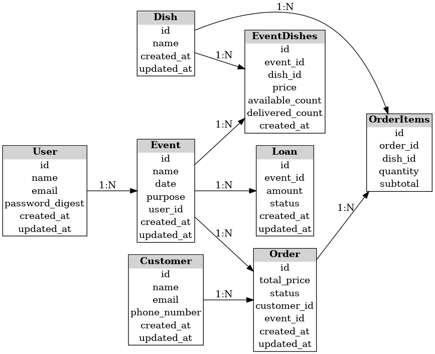

## Entities and Attributes

### 1. **User**
- **Attributes**:
  - `id`
  - `name`
  - `email`
  - `password_digest`
  - `created_at`
  - `updated_at`
- **Relationships**:
  - A `User` has many `Events`.

### 2. **Event**
- **Attributes**:
  - `id`
  - `name`
  - `date`
  - `purpose`
  - `user_id` (foreign key to associate with User)
  - `created_at`
  - `updated_at`
- **Relationships**:
  - An `Event` belongs to a `User`.
  - An `Event` has many `Dishes`, `Orders`, and `Loans`.

### 3. **Dish**
- **Attributes**:
  - `id`
  - `name`
  - `created_at`
  - `updated_at`
- **Relationships**:
  - A `Dish` belongs to many `Events` through `EventDishes`.
  - A `Dish` belongs to many `Orders` through `OrderItems`.

### 4. **EventDishes (Join Table)**
- **Attributes**:
  - `id`
  - `event_id`
  - `dish_id`
  - `price`
  - `available_count`
  - `delivered_count`
  - `created_at`
- **Relationships**:
  - `EventDishes` connects `Event` and `Dish`.

### 5. **Order**
- **Attributes**:
  - `id`
  - `total_price`
  - `status` (`pending`, `paid`, `canceled`)
  - `customer_id`
  - `event_id`
  - `created_at`
  - `updated_at`
- **Relationships**:
  - An `Order` belongs to a `Customer`.
  - An `Order` belongs to an `Event`.
  - An `Order` has many `Dishes` through `OrderItems`.

### 6. **OrderItems (Join Table)**
- **Attributes**:
  - `id`
  - `order_id`
  - `dish_id`
  - `quantity`
  - `subtotal`
- **Relationships**:
  - `OrderItems` connects `Order` and `Dish`.

### 7. **Customer**
- **Attributes**:
  - `id`
  - `name`
  - `email`
  - `phone_number`
  - `created_at`
  - `updated_at`
- **Relationships**:
  - A `Customer` has many `Orders`.

### 8. **Loan**
- **Attributes**:
  - `id`
  - `event_id`
  - `amount`
  - `status` (`unpaid`, `paid`)
  - `created_at`
  - `updated_at`
- **Relationships**:
  - A `Loan` belongs to an `Event`.

---

## Relationships Overview

### 1. **User**:
   - `1 -> N` relationship with **Event**.

### 2. **Event**:
   - `1 -> N` relationship with **Order**, **Loan**.
   - `N -> N` relationship with **Dish** through **EventDishes**.

### 3. **Dish**:
   - `N -> N` relationship with **Event** through **EventDishes**.
   - `N -> N` relationship with **Order** through **OrderItems**.

### 4. **Order**:
   - `N -> 1` relationship with **Customer** and **Event**.
   - `N -> N` relationship with **Dish** through **OrderItems**.

---

## ERD Diagram

