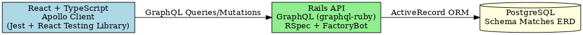

## Overview

The application is structured with a **React frontend** (TypeScript), a **Rails API backend**, and a **PostgreSQL database**. The components communicate via **GraphQL** for efficient data querying and manipulation.

---

## Frontend: React with TypeScript

### Technology Stack:
- **React**: Frontend library for building user interfaces.
- **TypeScript**: Adds type safety for better code quality and maintainability.
- **Apollo Client**: Manages GraphQL queries and mutations.
- **Jest + React Testing Library**: Used for component and integration testing.

### Features:
- Strongly-typed interfaces for all entities (e.g., `User`, `Event`, `Order`).
- GraphQL queries/mutations to interact with the backend.
- Component-based architecture for scalability.

---

## Backend: Rails API

### Technology Stack:
- **Rails API-only Application**: Lightweight server optimized for APIs.
- **GraphQL-Ruby Gem**: Adds GraphQL capabilities to the Rails backend.
- **RSpec + FactoryBot**: For test-driven development and data generation.

### Features:
- Implements GraphQL types and resolvers for `User`, `Event`, `Order`, `Dish`, and more.
- ActiveRecord ORM for database interactions.
- API endpoints secured with validations and business logic.

---

## Database: PostgreSQL

### Features:
- Relational database with schema matching the ERD.
- Tables for entities like `User`, `Event`, `Dish`, `Order`, `Loan`, `EventDishes`, and `OrderItems`.
- Data integrity ensured via foreign key relationships.

---

## Communication

### GraphQL API:
- Frontend communicates with the backend using GraphQL queries and mutations.
- Backend resolves GraphQL requests and interacts with the PostgreSQL database using ActiveRecord.

---

## Testing

### Backend:
- **RSpec**: For unit and integration tests.
- **FactoryBot**: To generate test data efficiently.

### Frontend:
- **Jest**: For running test cases.
- **React Testing Library**: For testing React components and DOM interactions.

---

## Diagram Representation

