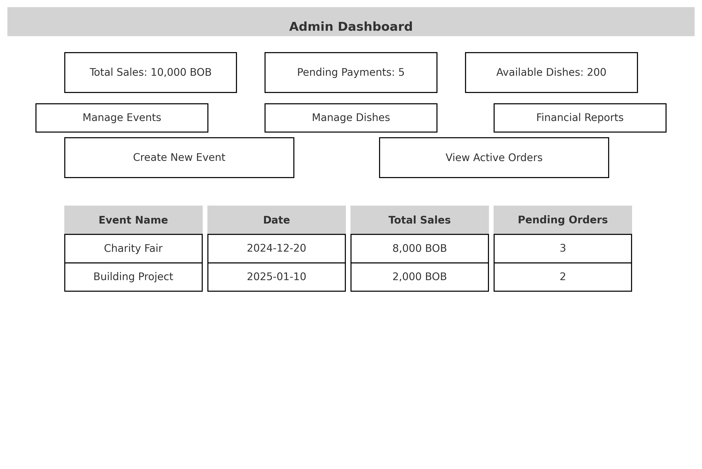
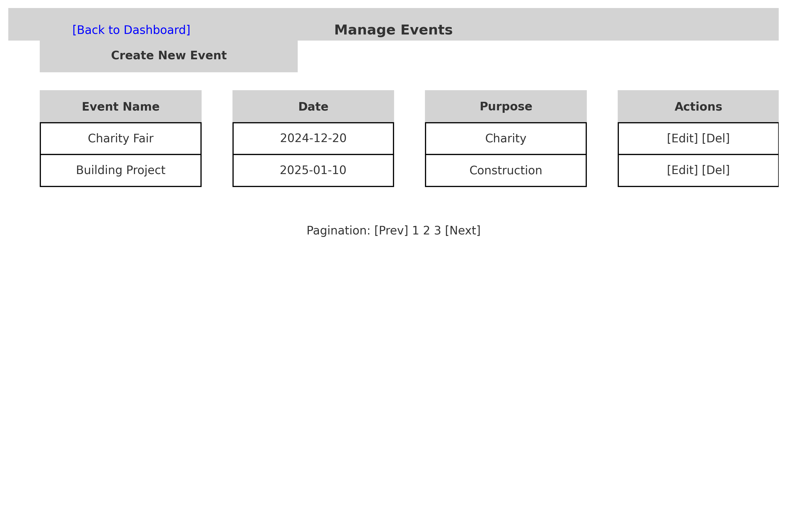
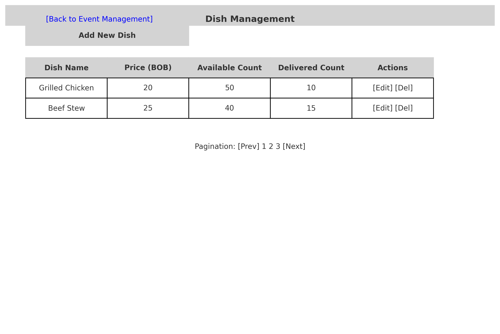
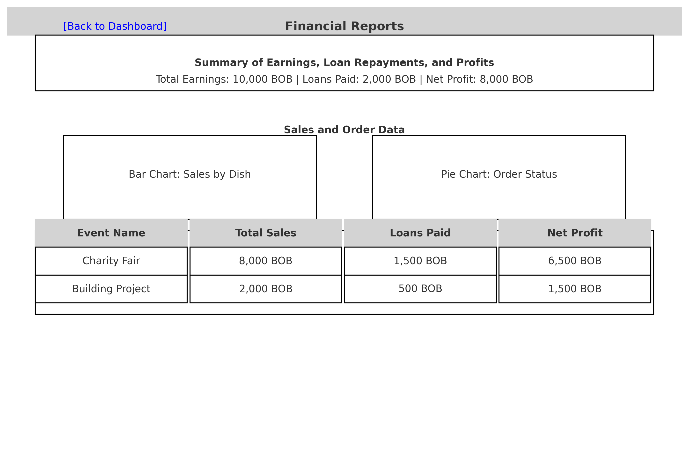
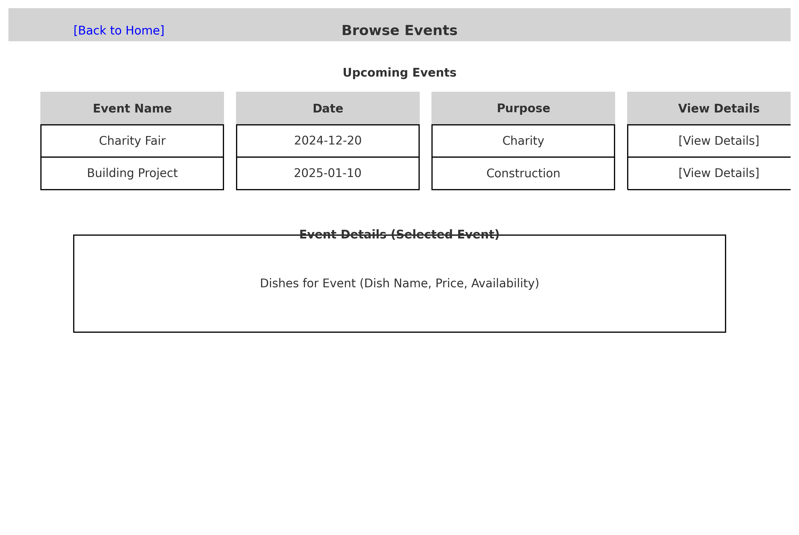
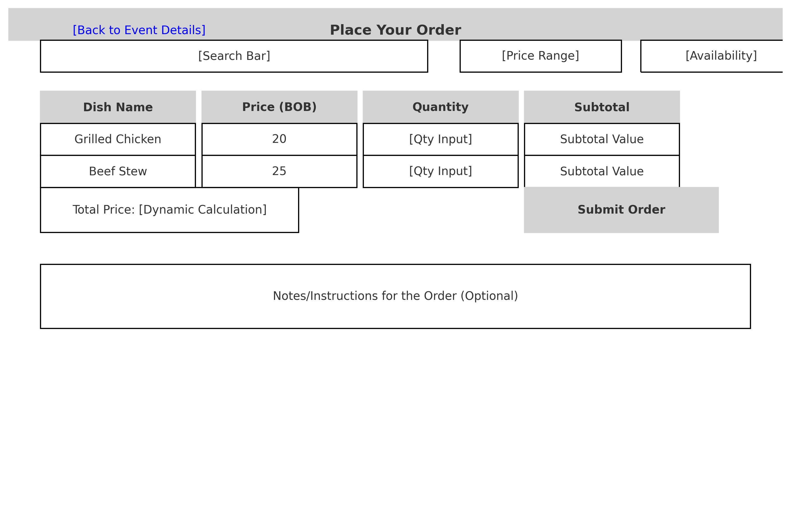
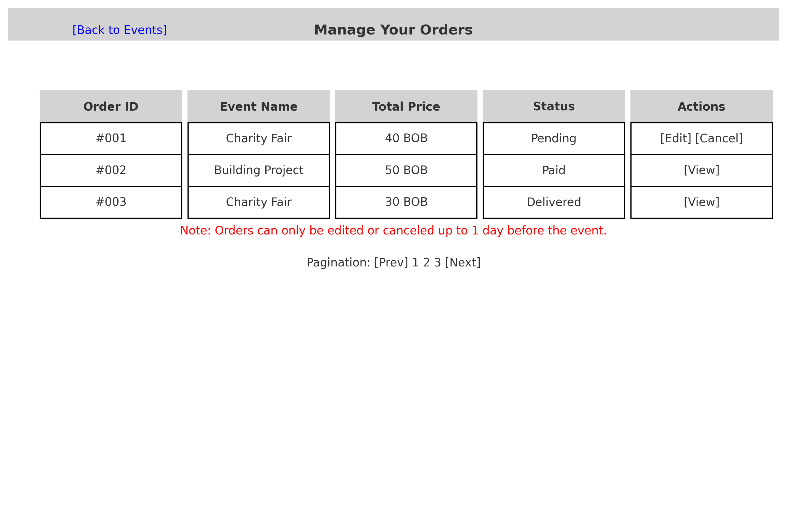
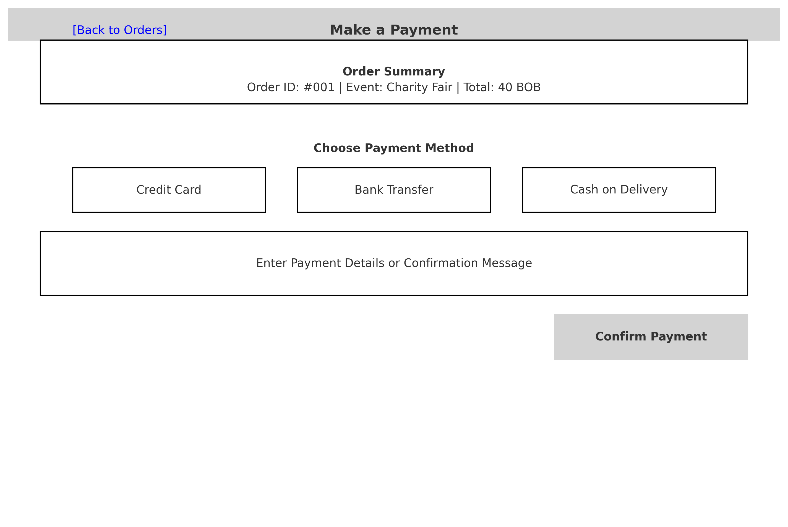

### **Admin Interface**

1. **Admin Dashboard**
    - Overview of key metrics (total sales, pending payments, dish availability).
    - Navigation to manage events, dishes, and reports.
        
        

        
        
    
2. **Event Management Page**
    - List of events with options to create, edit, or delete events.
    - Detail view of a single event showing associated dishes and orders.
        
        
        
    
3. **Dish Management Page**
    - List of dishes for a selected event.
    - Options to add, update, or delete dishes.
    - Overview of dish availability and delivery counts.
        
        
        
    
4. **Financial Reports Page**
    - Summary of event earnings, loan repayments, and profits.
    - Visual reports for sales and order data.
        
        
        
    

### **Customer Interface**

1. **Event Browsing Page**
    - List of upcoming events.
    - Detail view of an event showing available dishes.
        
        
        
2. **Order Placement Page**
    - Form to select dishes, quantities, and submit an order.
    - Dynamic price calculation based on selected items.
        
        
        
3. **Order Management Page**
    - List of customer orders with options to edit or cancel (if within the deadline).
    - Status tracking for each order (pending, paid, delivered).
        
        
        
4. **Payment Page**
    - Interface to pay for an order.
    - Display of total cost, payment options, and confirmation.
        
        